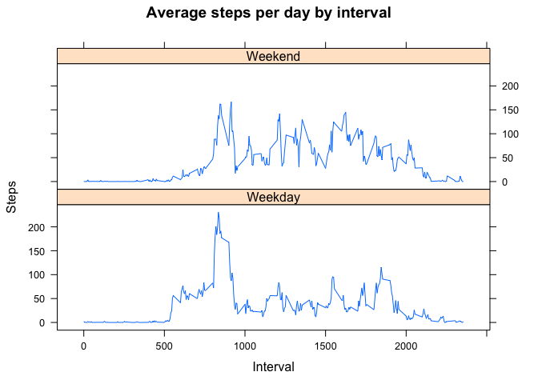

# Reproducible Research: Peer Assessment 1


## Loading and preprocessing the data

```r
file <- unzip("activity.zip")
activity <- read.csv(file)
stepsbyday  <- aggregate(steps ~ date, data = activity, sum, na.rm = TRUE)
```

## What is mean total number of steps taken per day?
1. Make a histogram of the total number of steps taken each day


```r
hist(stepsbyday$steps, main = "Frequency of number of steps per day", 
     xlab = "Number of steps per day")
```

 

2. Calculate and report the mean and median total number of steps taken per day


```r
a <- mean(stepsbyday$steps)
paste ("Mean number of steps is", a)
```

```
## [1] "Mean number of steps is 10766.1886792453"
```

```r
b <- median(stepsbyday$steps)
paste ("Median  number of steps is", b)
```

```
## [1] "Median  number of steps is 10765"
```
The mean total number of steps taken per day is 10766 steps.
The median total number of steps taken per day is 10765 steps.

## What is the average daily activity pattern?
* Make a time series plot (i.e. type = “l”) of the 5-minute interval (x-axis) and the average number of steps taken, averaged across all days (y-axis)


```r
stepsbyinterval <- aggregate(steps ~ interval, data = activity, mean, na.rm = TRUE)
plot(steps ~ interval, data = stepsbyinterval, type = "l")
```

 

* Which 5-minute interval, on average across all the days in the dataset, contains the maximum number of steps?


```r
maxstepsinterval <- stepsbyinterval[which.max(stepsbyinterval$steps), ]$interval
```

835th interval contains the maximum number of steps.

## Imputing missing values

1. Calculate and report the total number of missing values in the dataset (i.e. the total number of rows with NAs)

```r
sum(!complete.cases(activity))
```

```
## [1] 2304
```
Number of missing data: 2304 rows

2. I use the mean for that 5-minute intervals. Mean values for each interval is in stepsbyinterval dataset.

3. Create a new dataset that is equal to the original dataset but with the missing data filled in.

```r
FilledActivity <- transform(activity, steps = ifelse(is.na(activity$steps), stepsbyinterval$steps[match(activity$interval, stepsbyinterval$interval)], activity$steps))
```

4. Make a histogram of the total number of steps taken each day and Calculate and report the mean and median total number of steps taken per day.

```r
FilledStepsByDay <- aggregate(steps ~ date, data = FilledActivity, sum)
hist(FilledStepsByDay$steps)
```

 

```r
c <- mean(FilledStepsByDay$steps)
paste ("Mean number of filled steps is", c)
```

```
## [1] "Mean number of filled steps is 10766.1886792453"
```

```r
d <- median(FilledStepsByDay$steps)
paste ("Median  number of steps is", d)
```

```
## [1] "Median  number of steps is 10766.1886792453"
```
The mean total number of steps taken per day is 10766 steps.
The median total number of steps taken per day is 10766 steps.
After filling NA data with average sateps taken by this interval mean and median become equal.

## Are there differences in activity patterns between weekdays and weekends?

```r
library(lattice)
weekdays <- c("Monday", "Tuesday", "Wednesday", "Thursday", "Friday")
FilledActivity$weekday <- as.factor(ifelse(is.element(weekdays(as.Date(FilledActivity$date)),weekdays), "Weekday", "Weekend"))

Filledstepsbyinterval <- aggregate(steps ~ interval + weekday, FilledActivity, mean)

xyplot(Filledstepsbyinterval$steps ~ Filledstepsbyinterval$interval|Filledstepsbyinterval$weekday, main="Average steps per day by interval",xlab="Interval", ylab="Steps",layout=c(1,2), type="l")
```

 

On weekdays activity satarts ealier, but we see less steps in the middle of a day.
